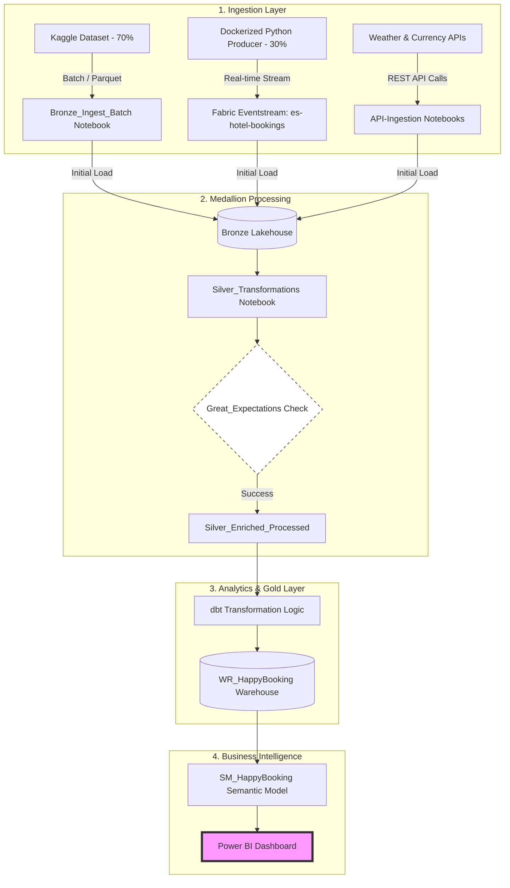

# 🏨 HappyBooking: End-to-End Data Engineering Project on Microsoft Fabric

This project demonstrates a comprehensive data engineering pipeline using **Microsoft Fabric**, following the **Medallion Architecture**. It integrates batch and streaming data, enriches it via external APIs, ensures data quality with Great Expectations, and models the final data using **dbt** for Power BI reporting.

## 🏗️ Architecture Overview
The project follows a modular approach to data processing:
1. **Ingestion**: Hybrid approach using Batch (Kaggle) and Stream (Docker-based simulation).
2. **Medallion Layers**: 
   - **Bronze**: Raw data ingestion from Lakehouse, Eventstream, and APIs.
   - **Silver**: Data cleaning, validation (Great Expectations), and enrichment.
   - **Gold**: Dimensional modeling using dbt in a Data Warehouse.


3. **Serving**: Semantic Modeling and Power BI Dashboarding.
4. **Automation**: Orchestration via Fabric Pipelines and CI/CD via GitHub Actions.
---

## 📊 Pipeline Architecture 



---

---
📥 Data Source
The foundational dataset used in this project is sourced from Kaggle:

Dataset: [Raw Booking Data on Kaggle](https://www.kaggle.com/datasets/aliosmanozpinar/raw-booking-data)

Scope: This raw dataset provided the core booking records, which were then partitioned for batch (70%) and stream (30%) simulation.
## 🚀 Key Features

### 1. Hybrid Data Ingestion
- **Batch Data**: 70% of the Kaggle dataset was loaded into the Lakehouse as files and processed via the `Bronze_Ingest_Batch` notebook into Delta tables.
- **Stream Simulation**: 30% of the data was treated as real-time. A **Dockerized Python producer** (`stream_producer.py`) simulated live bookings, sending data to **Fabric Eventstream** (`es-hotel-bookings`), which landed in the Lakehouse as `bronze_hotel_stream`.


- **External APIs**: Integrated weather and currency data using `API-Ingestion` notebooks. API calls were dynamic, based on the specific dates and locations found in our hotel dataset.

### 2. Transformation & Quality Assurance (Silver Layer)
- **Cleaning**: The `Silver_Transformations` notebook performed comprehensive data cleansing (regex cleaning, ID normalization, etc.).
- **Data Quality**: Integrated **Great Expectations** to validate data integrity before moving to the enrichment phase.


- **Enrichment**: Joined cleaned hotel data with API-sourced weather and currency metrics in the `silver_enriched_processes` notebook.

### 3. Analytics Engineering (Gold Layer)
Using **dbt (data build tool)** within the Fabric environment:
- **Environment**: Developed in the `dbt_HappyBooking` item.
- **Models**: Created a Star Schema in the `WR_HappyBooking` Warehouse:
    - `dim_customers`, `dim_date`, `dim_hotels`
    - `fct_bookings`


- **Warehouse**: All models were materialized as tables in the Fabric Data Warehouse.

### 4. BI & Orchestration
- **Reporting**: Built a **Semantic Model** (`SM_HappyBooking`) and a comprehensive Power BI **HappyBooking_Dashboard** for visual insights.


- **Automation**: Created `Pipeline_Automation` to orchestrate the entire flow from ingestion to refresh, scheduled on a daily basis.

---

## 🛠️ Tech Stack
* **Platform**: Microsoft Fabric (Lakehouse, Warehouse, Eventstream)
* **Processing**: PySpark, Spark SQL
* **Transformation**: dbt (data build tool)
* **Data Quality**: Great Expectations
* **Containerization**: Docker (for stream simulation)
* **Automation**: Fabric Pipelines, GitHub Actions (CI/CD)
* **Visualization**: Power BI

---

## 📂 Project Structure
```text
├── docker/
│   ├── Dockerfile
│   └── stream_producer.py        # Simulated streaming producer
├── notebooks/
│   ├── Bronze_Ingest_Batch.py
│   ├── API-Ingestion.py          # Weather API integration
│   ├── API-Ingestion-2.py        # Currency API integration    
│   ├── Silver_Transformations.py # Data Cleansing
│   ├── Great_Expectations.py     # Data Quality Checks
│   └── silver_enriched_processes.py # API & Data merging
├── dbt_models/                   # dbt project files
│   ├── dbt_project.yml
│   └── models/                   # dim & fct SQL models
├── pipelines/                   # project pipeline
│   └── Pipeline_Automation.DataPipeline
└── .github/workflows/
    └── fabric_ci.yml             # CI/CD Automation
```

---

## ⚙️ How to Run
1. **Ingestion**: Run the Docker container in the `docker/` folder to start the live stream.
2. **Fabric Pipeline**: Trigger the `Pipeline_Automation` in Microsoft Fabric to process the Medallion layers.
3. **CI/CD**: Any changes pushed to the `dev` branch will trigger GitHub Actions for validation before merging to `main`.


-----------------------


---
